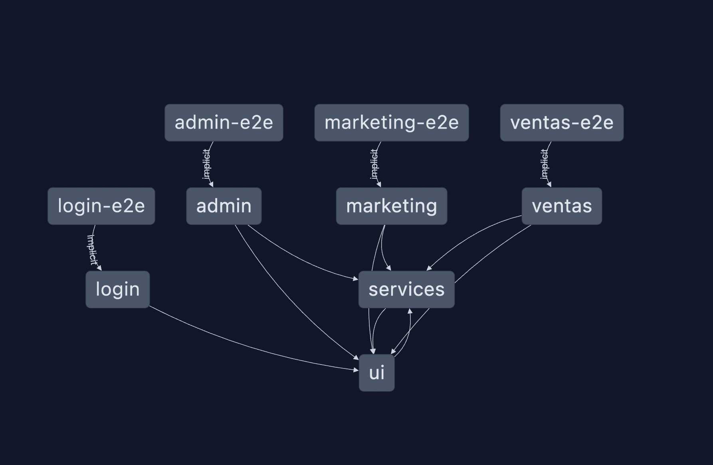

# Verisure - Consulta oferta

### ¡Este proyecto está realizado con [NX](https://nx.dev/) (Utilizando el framework **Angular 15**)!

_(nx es una herramienta para la creación de mono repos)_

##### En este proyecto, se incluyen 4 sub-aplicaciones front-end relacionadas con el proceso de "Consulta Oferta", conectada a 2 librerías (las cuales actúan como packages que manejaremos a nivel local)

Imagen de referencia, de cómo estas apps están relacionadas.


##### Este gráfico ha sido generado con el siguiente comando:

```
nx dep-graph
```

## Instalación de dependencias previas

### 1. Node and NPM

Para este proyecto, se debe tener instalado una versión igual o superior de node 18.13.0ˆ + npm 8.19.3

[Descargar aquí](https://nodejs.org)

### 2. Docker

Desde la página oficial de [Docker](https://www.docker.com/), hacemos click en el botón de "Download Docker Desktop".

## Setup del proyecto (repositorio)

### Configurar Docker

- Ejecutamos el siguiente comando para CREAR el NETWORK de nuestra aplicación (OPCIONAL):

```bash
  docker network create -d bridge verisure-network
```

### Descargar código

- Clonamos el proyecto desde el repositorio de BITBUCKET

```bash
  git clone https://bitbucket.dev.verisure.com/projects/CLLOCAL/repos/consultaOferta_front-end
  cd consultaoferta_front-end
```

### Instalar paquetes

- Entramos al proyecto y procederemos a instalar las dependencias del mismo con npm:

```bash
  npm install
```

### Variables de entorno

- Al abrir el archivo "enviroments/environment.prod.ts", encontraremos un objeto como el siguiente (aquí tendremos que configurar y utilizar las variables de entorno de active directory):

```js
.....
  export const environment = {
    // controla el estado entre dev y prod de la app
  production: true,
  acc_config: {
     // controla el estado entre dev y prod de la active directory
    production: true,
    // reemplazar AWS_VAR_TENANT_ID por el tenant id de Active directory
    authority: 'https://login.microsoftonline.com/' + 'AWS_VAR_TENANT_ID' + '/',
     // reemplazar AWS_VAR_BASE_FRONT_URL por el url del front, para configurar el redireccionamiento de active directory
    redirectUri: 'AWS_VAR_BASE_FRONT_URL' + '/v1/oauth/login',
    clientId: 'AWS_VAR_CLIENT_ID',
  },
  // AWS_VAR_GRAPH_ENDPOINT : url del graph de active directory
  graph_endpoint: 'AWS_VAR_GRAPH_ENDPOINT',
      //id_groups<objects>: hace referencia a los ID de los grupos de active directory, los cuales controlan los accesos
  id_groups: {
    ventas: 'AWS_VAR_ID_GROUPS_VENTAS',
    marketing: 'AWS_VAR_ID_GROUPS_MARKETING',
    admin: 'AWS_VAR_ID_GROUPS_ADMIN',
    superAdmin: 'AWS_VAR_ID_GROUPS_SUPERADMIN',
  },

....
```

Ejemplo de otras variables menos críticas:

```js
...
  ,

      //AWS_VAR_APIGATEWAY_URL url del backend
  apigateway_url: 'AWS_VAR_APIGATEWAY_URL',
   // Variables para el formulario de consulta oferta (venta)
  form: {
    // Configuración del input prospecto, para esto tenemos que tener los IDs de RP Y RE que nos da la base de datos y el estado (obligatorio = true o opcional = false)
  prospecto_rp:
      '{"verisureId": "PROSP_RP_ID", "requiredStatus": PROSP_RP_STATUS }',
    prospecto_re:
      '{"verisureId":"PROSP_RE_ID", "requiredStatus":PROSP_RE_STATUS}',
    rango_rut: 'RANGO_RUT',
    id_segmento_residencia: 'SEG_RESIDENCIA',
  },
  // URL de POWER BI de reportería
  // sí se usa el entorno de amazon, recordar remplazar " & " por " \& "
  reporteria_url: 'REPORTERIA_URL',
  // version de la aplicación
  app_version: 'x.x.x-Alpha',
};
```

- Una vez visto nuestras variables de entorno, podremos buildear todas las aplicaciones con el siguiente comando:

```bash
  ng run-many --target=build --skip-nx-cache
```

- Ahora, procederemos a publicarla con NGINX y la ayuda de docker compose, con el siguiente comando:

```bash
  docker-compose -f docker-compose.yml -p verisure-consulting2-web-site up --build -d
```

¡Listo!, ahora se podrá utilizar la aplicación en local:
http://localhost:8080

## Ejecución de comandos con NX

```
nx g <plugin name>:<generator name> <default option / name> <other options>
```

Ejemplo de como crear un componente de angular llamado "Home":

```
nx g @nrwl/angular:component Home  --skip-import -—standalone
```

> Para saber más de cómo usar los comandos de angular en NX, puede derigirse a: https://nx.dev/angular-tutorial/1-code-generation

## Branchs y ambientes

Master: Relacionado a ambiente prod.

Develop: Relacionado a ambiente QA y Dev

Features/xxx: Nuevos cambios o implementaciones

Hotfix/xxx: Arreglos o ajustes
